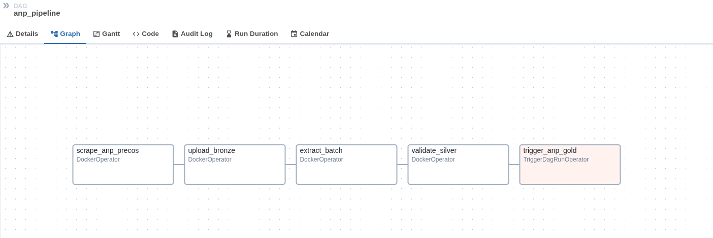
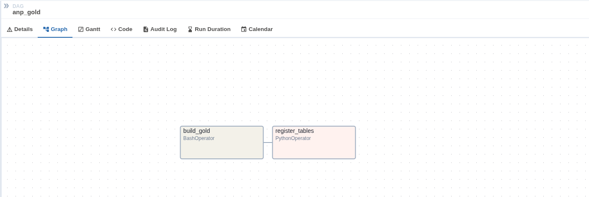
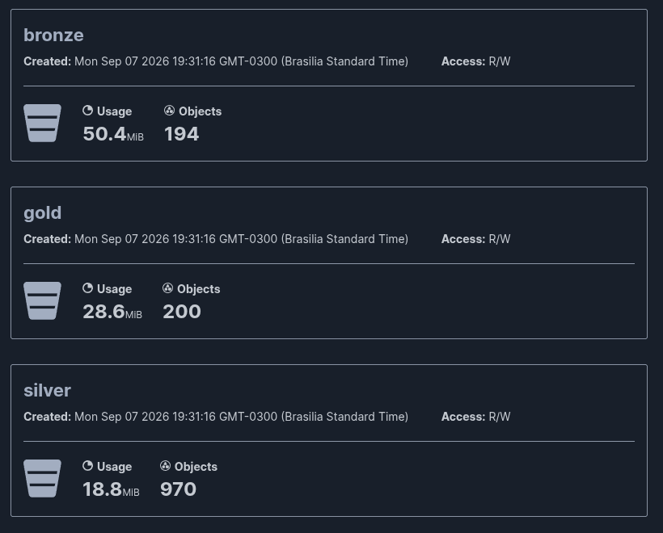
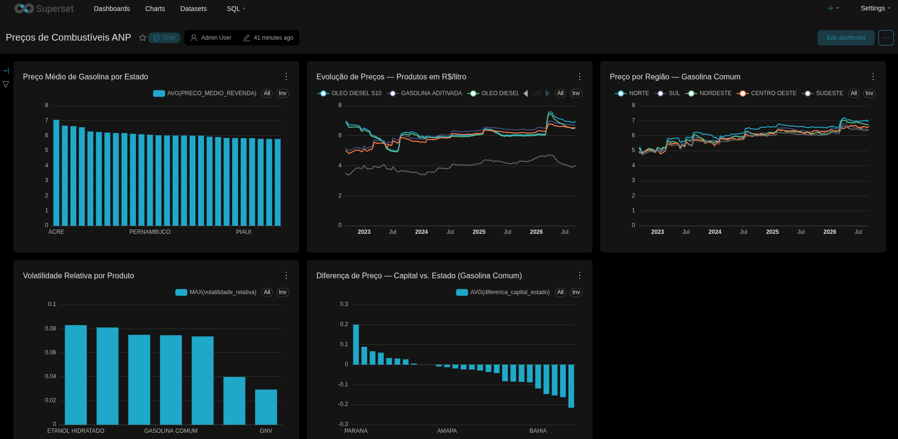
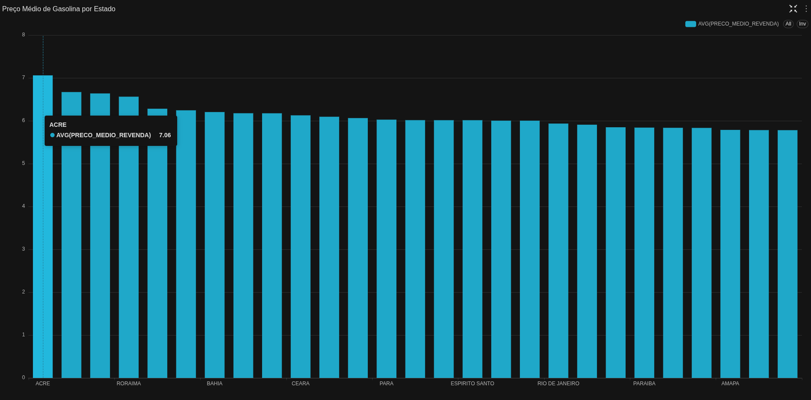
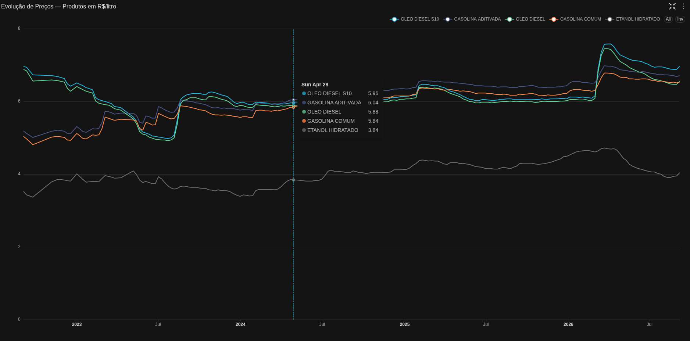
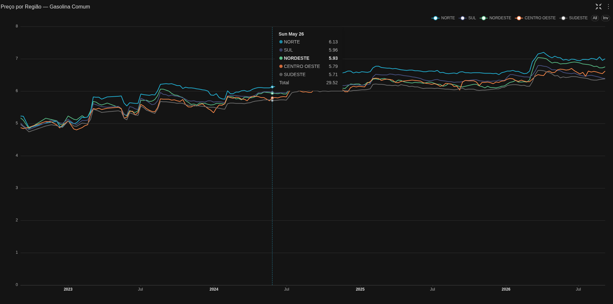
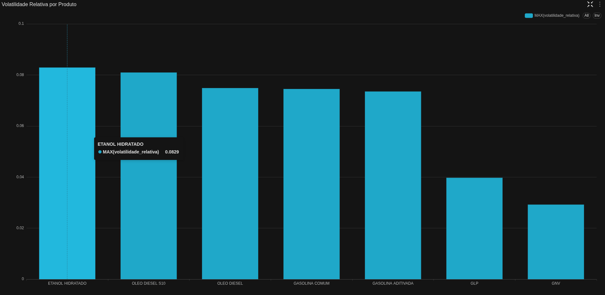
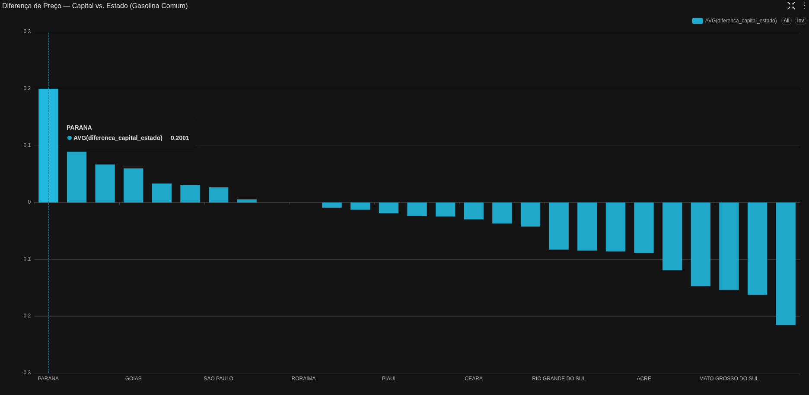

# Data Engineering — Lakehouse com Dados de Preços de Combustíveis (ANP)

## Introdução

Este projeto nasce do aprofundamento do estudo sobre o material do professor **Weslley Moura**, na disciplina de Arquitetura de Dados da Especialização em Ciência de Dados da UTFPR. A partir de um fork do repositório original da disciplina, o projeto evoluiu para explorar, na prática, os conceitos de arquitetura de *lakehouse* aplicados sobre uma base de dados real, pública e desconhecida do material do curso. A matéria foi realizada no segundo semestre de 2026.

O resultado é um pipeline completo, orquestrado e automatizado: da coleta semanal na fonte original até um dashboard analítico construído sobre a camada gold.

## Estrutura de Lakehouse

O projeto segue a arquitetura de *lakehouse* em três camadas, armazenadas no Minio (object storage compatível com S3):

- **Bronze** — dado bruto, cópia fiel da fonte original, sem qualquer tratamento.
- **Silver** — dado limpo, tipado e normalizado, pronto para ser consumido de forma confiável.
- **Gold** — dado agregado e modelado para consumo analítico.

| Bucket | Objetos | Tamanho |
|---|---|---|
| bronze | 194 | 50.4 MiB |
| silver | 970 | 18.8 MiB |
| gold | 200 | 28.6 MiB |

**Stack:** Minio (armazenamento), Spark + Delta Lake (processamento), Hive metastore (catálogo), Airflow (orquestração), Superset (visualização), além de um container auxiliar em Python para tarefas de coleta e reparo de arquivos.

## Dataset

A fonte de dados utilizada é o **Levantamento de Preços de Combustíveis**, publicado semanalmente pela ANP (Agência Nacional do Petróleo, Gás Natural e Biocombustíveis).

- **Período coberto:** semanal, desde setembro de 2022 até o presente.
- **Volume:** 194 planilhas (uma por semana pesquisada).
- **Estrutura de cada planilha:** 5 abas — `CAPITAIS`, `MUNICIPIOS`, `ESTADOS`, `REGIOES` e `BRASIL` — cada uma com um nível diferente de agregação geográfica, todas extraídas e mantidas no projeto.
- **Colunas (nível MUNICIPIOS/CAPITAIS):**
  - `DATA INICIAL`, `DATA FINAL`, `ESTADO`, `MUNICÍPIO`, `PRODUTO`
  - `NÚMERO DE POSTOS PESQUISADOS`, `UNIDADE DE MEDIDA`
  - `PREÇO MÉDIO REVENDA`, `DESVIO PADRÃO REVENDA`, `PREÇO MÍNIMO REVENDA`, `PREÇO MÁXIMO REVENDA`, `COEF DE VARIAÇÃO REVENDA`

## Fluxo de Orquestração

```
ANP (fonte)
    │
    ▼  scraping
Bronze (Minio) ......... arquivos .xlsx crus
    │
    ▼  extração + reparo + validação (gate de qualidade)
Silver (Minio) ......... .parquet limpo, 5 níveis geográficos
    │
    ▼  agregação (Spark) + registro no catálogo
Gold (Minio) ........... 7 tabelas Delta
    │
    ▼
Superset ............... dashboards

DAG anp_pipeline: scraping → bronze → silver → validação
        └── dispara ──► DAG anp_gold: agregação → catálogo
```

A separação em duas DAGs é uma decisão de arquitetura: `anp_pipeline` cuida da ingestão e preparação (roda diariamente), enquanto `anp_gold` cuida da agregação analítica (computacionalmente mais pesada), disparada automaticamente apenas quando o silver passa no gate de validação.

### DAG `anp_pipeline` — ingestão, extração e validação

<p align="center">
  
</p>


Roda diariamente às 06h. A ANP publica a pesquisa da semana entre segunda e terça-feira; rodar todo dia evita atraso de uma semana inteira caso o dia de publicação varie.

| Task | Operador | Função |
|---|---|---|
| `scrape_anp_precos` | DockerOperator | Baixa os arquivos `.xlsx` novos publicados pela ANP, pulando os que já existem |
| `upload_bronze` | DockerOperator | Envia os arquivos crus para o bucket `bronze` do Minio, sem qualquer tratamento |
| `extract_batch` | DockerOperator | Lê os arquivos do bronze, repara os malformados, extrai as 5 abas de cada planilha e salva como `.parquet` no bucket `silver` |
| `validate_silver` | DockerOperator | Gate de qualidade — valida schema, nulos, consistência de preços e duplicatas em todas as abas do silver. Bloqueia a pipeline se algo falhar, antes de propagar dado suspeito para o gold |
| `trigger_anp_gold` | TriggerDagRunOperator | Dispara a DAG `anp_gold` assim que o silver é validado com sucesso |

### DAG `anp_gold` — agregação e catálogo

<p align="center">
  
</p>

| Task | Operador | Função |
|---|---|---|
| `build_gold` | BashOperator | Roda o job Spark que lê o silver, normaliza nomes de coluna e materializa 7 tabelas Delta no bucket `gold`: os 5 níveis geográficos, uma dimensão de produto (`dim_produto`, com volatilidade relativa) e uma tabela derivada (`fct_diferenca_capital_estado`) |
| `register_tables` | PythonOperator | Registra cada tabela no catálogo do Thrift Server, tornando-as consultáveis pelo Superset |

## Buckets

<p align="center">
  
</p>

## Exploração de Dados (KDD)

Os principais experimentos e análises exploratórias estão documentados no
[notebook da KDD](exploracao_kdd_anp.ipynb).

Antes de definir a modelagem do gold, foi conduzida uma exploração completa sobre os dados do silver — schema, qualidade, distribuição, séries temporais e comparações geográficas. Os principais achados:

- **Qualidade do dado:** zero nulos, zero duplicatas e zero violação da regra mínimo ≤ médio ≤ máximo em 445 mil linhas de município. A fonte se mostrou notavelmente consistente ao longo de quatro anos.

- **Unidades de medida distintas por produto:** GLP (R$/13kg) e GNV (R$/m³) não são comparáveis diretamente com os demais produtos, medidos em R$/litro — o que exige tratamento separado em qualquer visualização ou agregação.

- **Eventos tributários visíveis na série temporal:** saltos abruptos de preço em meados de 2023 e no início de 2026 correspondem a mudanças reais de ICMS e PIS/Cofins, confirmadas por fontes externas. Esses mesmos pontos foram detectados estatisticamente via Teste de Chow e detecção automática de changepoint (`ruptures`), sem conhecimento prévio das datas — uma validação cruzada entre o que a legislação diz e o que os dados mostram sozinhos.

- **Capital nem sempre é mais cara que o interior:** em estados como Maranhão, Pará e Mato Grosso do Sul, é o interior que puxa o preço médio para cima, provavelmente reflexo do custo logístico de distribuição em territórios extensos.

- **Volatilidade depende da métrica escolhida:** em termos absolutos o GLP é o mais volátil, mas apenas porque opera numa escala de preço ~20x maior. Normalizando pelo coeficiente de variação, o Etanol Hidratado se revela o produto mais sensível a oscilações — coerente com sua dependência da safra de cana-de-açúcar.

- **Modelagem preditiva foi avaliada e descartada:** modelos de regressão testados não superaram um baseline ingênuo em nenhum horizonte de previsão. O preço de combustível no Brasil é dominado por eventos de política tributária, que não são inferíveis a partir do histórico de preços isoladamente.

## Dashboard

<p align="center">
  
</p>

Dashboard **"Preços de Combustíveis ANP"** no Superset, com 5 gráficos interativos construídos sobre as tabelas gold:

1. **Preço Médio de Gasolina por Estado** — ranking dos 27 estados, do mais caro (Acre, R$ 7,06) ao mais barato.
2. **Evolução de Preços — Produtos em R$/litro** — série temporal nacional com as 5 linhas de produtos comparáveis, evidenciando os eventos de reajuste tributário.
3. **Preço por Região — Gasolina Comum** — comparação entre as 5 regiões do país ao longo do tempo, com o Norte consistentemente acima da média nacional.
4. **Volatilidade Relativa por Produto** — ranking por coeficiente de variação, com Etanol Hidratado no topo.
5. **Diferença de Preço — Capital vs. Estado** — o achado mais original da exploração, mostrando em quais estados a capital é mais cara (Paraná, +R$ 0,20) ou mais barata (Maranhão, −R$ 0,22) que o resto do território.

<p align="center">
  
  
</p>

<p align="center">
  
  
</p>

<p align="center">
  
</p>


## Decisões de Arquitetura e Desafios

Rodar a stack em um servidor próprio, que já hospedava outros serviços, expôs uma série de questões que um ambiente limpo de tutorial não apresenta. As principais decisões tomadas ao longo do desenvolvimento:

**Container auxiliar para tarefas fora do escopo do Spark.** O Spark não lê `.xlsx` nativamente, e parte dos arquivos da ANP (cerca de 9 dos 194, concentrados entre dez/2022 e abr/2023) foi publicada em um formato OOXML malformado que bibliotecas de leitura programática não conseguem abrir — embora abram normalmente em aplicações de planilha. A solução foi manter um container Python dedicado, com LibreOffice headless disponível, responsável por scraping, reparo e extração inicial. O Airflow dispara esse container via `DockerOperator`, mantendo cada ferramenta na imagem adequada ao seu propósito.

**Gate de qualidade como etapa explícita da pipeline.** Ainda que a exploração tenha mostrado um dataset muito consistente, não há garantia de que a fonte permanecerá assim. A task `validate_silver` verifica schema, nulos, consistência de preços e duplicatas em todas as abas, e interrompe a pipeline em caso de falha — impedindo que dado suspeito chegue à camada gold e, por consequência, aos dashboards.

**Normalização de nomes de coluna na fronteira do gold.** O Delta Lake não aceita espaços ou caracteres especiais em nomes de coluna. Em vez de habilitar o mapeamento de colunas do Delta, optou-se por normalizar os nomes (maiúsculas, sem espaço ou acento) ao materializar as tabelas — o que também torna as consultas SQL no Superset e no dbt bem mais diretas.

**Registro de tabelas em duas etapas.** O job Spark que grava as tabelas e o Thrift Server que as serve utilizam catálogos Hive independentes. Os dados são gravados fisicamente no bucket gold pelo job, e cada tabela é então registrada no catálogo do Thrift Server como uma etapa separada da DAG — padrão já adotado no projeto original da disciplina, e que evita disputa de acesso ao metastore.

**Credenciais fora do controle de versão.** Todas as chaves e senhas foram migradas do `docker-compose.yml` para variáveis de ambiente, com o arquivo correspondente excluído do repositório.

**Permissões entre host e container.** Serviços como o Airflow escrevem em volumes montados usando um UID próprio, o que gera conflito de permissão com o usuário do host. A solução adotada foi conceder acesso via ACL ao UID do container, preservando o dono original dos arquivos em vez de substituí-lo.

**Limitação de recursos como restrição real de projeto.** O servidor dispõe de pouco mais de 7 GB de RAM compartilhados entre todos os serviços. O job de construção do gold é a etapa mais pesada da pipeline e chegou a saturar a memória disponível em uma das execuções. As DAGs foram configuradas sem retentativas automáticas e com limite de execuções simultâneas, justamente para evitar que uma falha por pressão de memória se agrave sozinha.

## Créditos

Stack de infraestrutura original e passo a passo: professor **Weslley Moura**, disciplina de Arquitetura de Dados (Especialização em Ciência de Dados, UTFPR). Pipeline de dados sobre a ANP, exploração, modelagem do gold, dashboards, adaptações de infraestrutura e documentação: Lucas.
